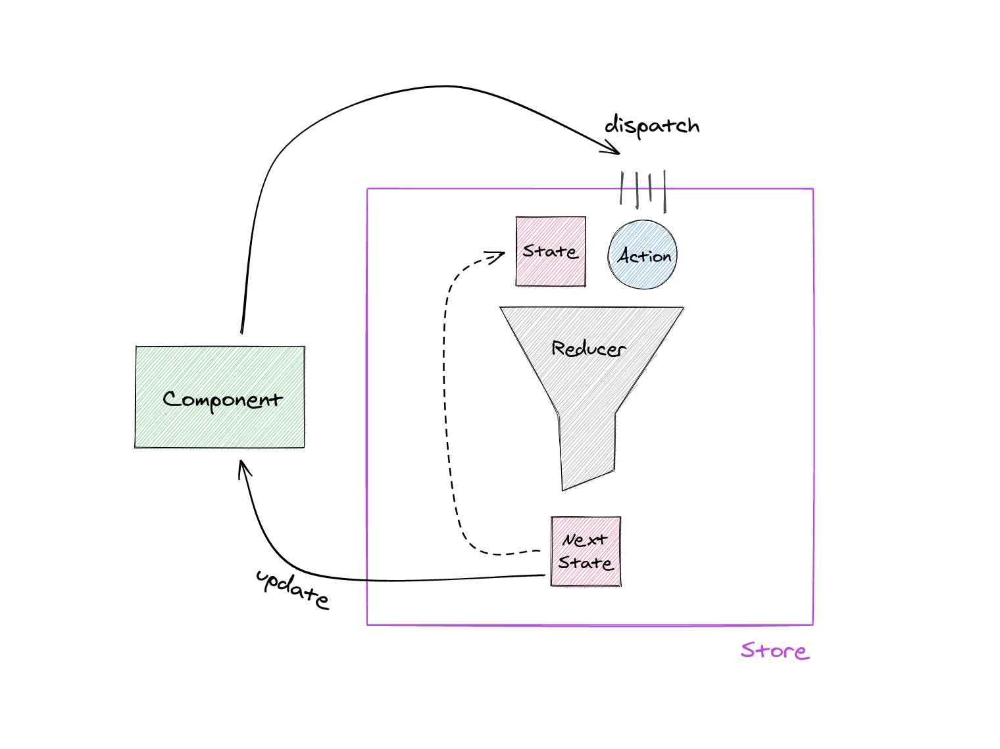

```toc

```

The concepts behind [NgRx](https://ngrx.io/) are inspired by the [Flux](https://facebook.github.io/flux/) architecture and it's most famous implementation: the [Redux](https://redux.js.org/) library. In theory, these concepts aren't too complicated, but in practice it might be hard to wrap your head around how everything fits together. So, let's demystify how NgRx works under the hood by coming up with a custom implementation of it - you'll be surprised with how few lines we can get really close to the real thing. At the same time we'll use our NgRx clone to implement a simple todo app.

[[book]]
| **[📕 I've written a book on NgRx.](https://gumroad.com/l/angular-ngrx-book)** Learn how to structure your state, write testable reducers and work with actions and effects from one well-crafted resource.

Three short [principles](https://redux.js.org/introduction/three-principles) are the foundation for state management with NgRx:

**Single Source of Truth**: The application state is stored in one object

**State is Read-Only**: You cannot change the current state, only dispatch an action and produce a new state.

**Changes are made with pure functions**: The next state is produced purely based on the current state and a dispatched action - no side-effects allowed

Together these principles make sure that state transitions are explicit and deterministic, meaning you can easily tell how the application state evolves over time.



## Action, State & Reducer

Our custom NgRx store implementation will be represented by a single file `store.ts` that reflects the principles just mentioned. Meanwhile, any app using this store can work with the same building blocks that you know from the real library.

### Action

Actions are plain JavaScript objects that reference events occurring in the application. Actions are distinguished by a type but can have arbitrary more properties to serve as a payload containing information about a corresponding event. We can leverage TypeScript's [index types](https://www.typescriptlang.org/docs/handbook/advanced-types.html#index-types) to define an interface representing the action data type:

```typescript
// store.ts
export interface Action {
  type: string
  [property: string]: any
}
```

Now, any object that has a `type` property can be used as an action in our application:

```typescript
const addTodoAction: Action = {
  type: 'ADD',
  text: 'Demystify NgRx',
}
```

We can even create custom action data types and action creators to ease development. That's _basically_ what the [createAction](https://ngrx.io/api/store/createAction) and [props](https://ngrx.io/api/store/props) functions from NgRx are doing - it doesn't give you quite the same type-safety though:

```typescript
// todos.actions.ts
export interface AddAction extends Action {
  type: 'ADD'
  text: string
}

export function addTodo(text: string): AddAction {
  return {
    type: 'ADD',
    text,
  }
}

export interface ToggleAction extends Action {
  type: 'TOGGLE'
  index: number
}

export function toggleTodo(index: number): ToggleAction {
  return {
    type: 'TOGGLE',
    index,
  }
}
```

We could [implement better type checking](https://redux.js.org/recipes/usage-with-typescript#type-checking-actions--action-creators) here, but let's not complicate things for now.

### State

A plain JavaScript object holds the global application state. In an actual application it can have many shapes, therefore we'll treat it as a generic type named `S` in our NgRx implementation. We'll use `S` for typing reducers and eventually initializing the store. Meanwhile, the state of our todo app will look like follows. So, for the todo app `State` will take the place of `S` everywhere where we refer to `S` in our custom NgRx implementation:

```typescript
// todos.state.ts
export interface Todo {
  index: number
  text: string
  done: boolean
}

export interface State {
  todos: Todo[]
}
```

The initial state for the todo app will just contain an empty array:

```typescript
// todos.state.ts
const initialState: State = { todos: [] }
```

### Reducer

A reducer is a pure function that takes the current state and an action as parameters while returning the next state. We can convert these claims into a type signature for a reducer using the generic state type `S` and our action interface:

```typescript
// store.ts
export type Reducer<S> = (state: S, action: Action) => S
```

Now, we can define a reducer for our todo app by implementing a function with this type. There we use the [spread syntax](https://developer.mozilla.org/en-US/docs/Web/JavaScript/Reference/Operators/Spread_syntax) to produce a new state based on an incoming action. Note that we'll use the initial state as a [default parameter](https://www.typescriptlang.org/docs/handbook/functions.html#optional-and-default-parameters). This way the reducer can be executed once without a state in order to supply the initial state to the store.

```typescript
// todos.reducer.ts
const reducer = (state = initialState, action: Action) => {
  switch (action.type) {
    case 'ADD':
      return {
        todos: [
          ...state.todos,
          {
            index: state.todos.length,
            text: action.text,
            done: false,
          },
        ],
      }
    case 'TOGGLE':
      return {
        todos: state.todos.map((todo, index) => {
          if (index === action.index) {
            return {
              ...todo,
              done: !todo.done,
            }
          }
          return todo
        }),
      }
    default:
      return state
  }
}
```

Normally, you'd be using the [createReducer](https://ngrx.io/api/store/createReducer) and [on](https://ngrx.io/api/store/on) functions to define a reducer. However, under the hood this is not really different from doing a switch-case on the action type. In fact, prior to Angular and NgRx 8 this was the normal way of writing reducers.

## Where Does NgRx Store Data?

NgRx stores the application state in an RxJS observable inside an Angular service called [Store](https://github.com/ngrx/platform/blob/10.0.0/modules/store/src/store.ts). At the same time, this service implements the `Observable` interface. So, when you subscribe to the store, the service actually forwards the subscription to the underlying observable.

Internally, NgRx is actually using a [BehaviorSubject](https://rxjs-dev.firebaseapp.com/api/index/class/BehaviorSubject) which is a special observable that has the following characteristics:

- new subscribers receive the current value upon subscription
- it requires an initial value
- since a BehaviorSubject is in turn a specialized [Subject](https://rxjs-dev.firebaseapp.com/guide/subject) you can emit a new value on it with `subject.next()`
- you can retrieve its current value synchronously using `subject.getValue()`

These characteristics also come in real handy for our custom store implementation where we'll also use a BehaviorSubject to hold the application state. So, let's create our own injectable Angular service `Store` by defining a corresponding class. It'll work with the generic state type `S` while its constructor accepts an application-specific reducer. We compute an initial state by executing the passed-in reducer with `undefined` and an initial action - just like NgRx's [INIT](https://ngrx.io/api/store/INIT) action.

Additionally, we provide a `dispatch` function accepting a single action. This function will retrieve the current state, execute the reducer and emit the resulting state through the BehaviorSubject.

Eventually, the BehaviorSubject is exposed in form of the more restrictive `Observable` type via `asObservable()` so that it's only possibly to cause a new state emission by dispatching an action.

So, here you go, **NgRx Store re-implementation in less than 20 lines of code**:

```typescript
// store.ts
import { Injectable } from '@angular/core'
import { Observable, BehaviorSubject } from 'rxjs'

@Injectable()
export class Store<S> {
  state$: Observable<S>

  private state: BehaviorSubject<S>

  constructor(private reducer: Reducer<S>) {
    const initialAction = { type: '@ngrx/store/init' }
    const initialState = reducer(undefined, initialAction)
    this.state = new BehaviorSubject<S>(initialState)
    this.state$ = this.state.asObservable()
  }

  dispatch(action: Action) {
    const state = this.state.getValue()
    const nextState = this.reducer(state, action)
    this.state.next(nextState)
  }
}
```

[[info]]
| Anything unclear? Post a comment below or ping me on Twitter [@n_mehlhorn](https://twitter.com/n_mehlhorn)

Note that the actual NgRx will allow you to register multiple reducers, however, for the sake of simplicity our implementation only accepts a single one. Either way, the approach stays the same: we're managing state through an RxJS BehaviorSubject - a pattern that has been described many times, for example [here](https://coryrylan.com/blog/angular-observable-data-services) by Cory Rylan. However, we also make state transitions explicit through actions while keeping each state read-only with pure reducer functions.

In order to use our custom store now for the todo app, we have to register it as a provider while passing an application-specific reducer. This can be done with a [value provider](https://angular.io/guide/dependency-injection-providers#value-providers) as follows. The actual NgRx is doing pretty much the same thing, it's just wrapped in another module.

```typescript
// app.module.ts
...
import { Store } from './store/store'
import { State } from './store/todos.state'
import { reducer } from './store/todos.reducer'

@NgModule({
  ...
  providers: [
    {provide: Store, useValue: new Store<State>(reducer)}
  ],
  ...
})
export class AppModule { }
```

Then we can use our store almost like the real NgRx store in a component:

```typescript
// app.component.ts
...
import { Store, Action } from "./store/store";
import { Todo, State } from "./store/todos.state";
import { addTodo, toggleTodo } from "./store/todos.actions";

@Component({...})
export class AppComponent  {

  state$: Observable<State>

  constructor(private store: Store<State>) {
    this.state$ = store.state$
  }

  add(text: string): void {
    this.store.dispatch(addTodo(text));
  }

  toggle(todo: Todo): void {
    this.store.dispatch(toggleTodo(todo.index));
  }
}
```

```html
<!-- app.component.html -->
<label for="text">Todo</label>
<input #textInput type="text" id="text" />
<button (click)="add(textInput.value)">Add</button>
<ul *ngIf="state$ | async as state">
  <li *ngFor="let todo of state.todos">
    <span [class.done]="todo.done">{{ todo.text }}</span>
    <button (click)="toggle(todo)">
      {{ todo.done ? 'X' : '✓'}}
    </button>
  </li>
</ul>
```

[[info]]
| Join my [mailing list](https://nils-mehlhorn.de/newsletter) and follow me on Twitter [@n_mehlhorn](https://twitter.com/n_mehlhorn) for more in-depth Angular & RxJS knowledge

## How NgRx Effects Works


NgRx effects are managing asynchronous side-effects with [RxJS observables](https://rxjs-dev.firebaseapp.com/guide/observable) resulting in actions being dispatched to the store. Since reducers are pure functions, they can't have side-effects - so things like HTTP requests aren't allowed. However, actions can be dispatched at anytime, for example as the result of an HTTP request that saves a todo to the server. Here's a corresponding action definition:

```typescript
// todos.actions.ts
export interface SavedAction extends Action {
  type: 'SAVED'
  todo: Todo
}

export function savedTodo(todo: Todo): SavedAction {
  return {
    type: 'SAVED',
    todo,
  }
}
```

And this is how you could dispatch it after the HTTP request:

```typescript
import { savedTodo } from './store/todos.actions'
import { Todo } from './store/todos.state'

this.http.post<Todo>('/todos', todo).subscribe((saved) => {
  this.store.dispatch(savedTodo(saved))
})
```

Yet, with the current setup, we can't really run this call before the reducer creates the actual todo. Therefore we'd need to wait for the `'ADD'` action to be processed. For this we need a way to hook into all dispatched actions. With some adjustments to our store implementation, we can simply expose another observable of actions through a regular [RxJS subject](https://rxjs-dev.firebaseapp.com/guide/subject):

```typescript{8,12,19,20,27}
// store.ts
import { Injectable } from '@angular/core'
import { Observable, BehaviorSubject, Subject } from 'rxjs'

@Injectable()
export class Store<S> {
  state$: Observable<S>
  action$: Observable<Action>

  private state: BehaviorSubject<S>

  private action = new Subject<Action>()

  constructor(private reducer: Reducer<S>) {
    const initialAction = { type: '@ngrx/store/init' }
    const initialState = reducer(undefined, initialAction)
    this.state = new BehaviorSubject<S>(initialState)
    this.state$ = this.state.asObservable()
    this.action$ = this.action.asObservable()
    this.action.next(initialAction)
  }

  dispatch(action: Action) {
    const state = this.state.getValue()
    const nextState = this.reducer(state, action)
    this.state.next(nextState)
    this.action.next(action)
  }
}
```

Now, we can use the `action$` observable from the store to compose a stream that maps the `'ADD'` action to an HTTP request which in turn will be mapped to the `'SAVED'` action. This stream could live inside a `TodoEffects` service:

```typescript
// todo.effects.ts
import { Injectable } from '@angular/core'
import { filter, mergeMap, map, withLatestFrom } from 'rxjs/operators'
import { Store } from './store'
import { State, Todo } from './todos.state'
import { savedTodo, AddAction } from './todos.actions'

@Injectable()
export class TodoEffects {
  constructor(private store: Store<State>, private http: HttpClient) {
    this.store.action$
      .pipe(
        // equivalent to NgRx ofType() operator
        filter((action) => action.type === 'ADD'),
        // fetch the latest state
        withLatestFrom(this.store.state$),
        // wait for HTTP request
        mergeMap(([action, state]: [AddAction, State]) => {
          // (use some kind of ID in a real app or only add todo to state after 'SAVED')
          const todo = state.todos[state.todos.length - 1]
          return this.http.post<Todo>('/todos', todo)
        }),
        // map to 'SAVED' action
        map((todo) => savedTodo(todo.index))
      )
      .subscribe((action) => this.store.dispatch(action))
  }
}
```

And that's almost all there is to NgRx effects. However, this implementation has two problems that are handled elegantly by the actual NgRx when using [createEffect](https://ngrx.io/api/effects/createEffect) to [register effects](https://ngrx.io/guide/effects#registering-root-effects):

1. The `TodoEffects` class won't be initialized by Angular when it's not injected by any component or service.

2. We're handling the subscription ourselves. This gets repetitive and we'd also have to handle errors. NgRx automatically retries failing effect streams up to 10 times.

Eventually, we can extend our reducer to handle the `'SAVED'` action. Note that I also added a new boolean property `saved` to the `Todo` interface. Usually this would rather be some kind of ID. You might also only want to add a todo to the state once it's saved to the server (see [Optimistic and Pessimistic UI Rendering Approaches](https://medium.com/@whosale/optimistic-and-pessimistic-ui-rendering-approaches-bc49d1298cc0)).

```typescript
// todos.reducer.ts
case "SAVED":
  return {
    todos: state.todos.map((todo, index) => {
      if (index === action.index) {
        return {
          ...todo,
          saved: true
        };
      }
      return todo;
    })
  };
```

## Learning NgRx

While it's fun and a good learning experience to implement NgRx store and effects yourself, you should definitely stick with the official library for real Angular apps. This way you'll get a tested and type-safe implementation with a lot more features.

[[info]]
| If you want to learn solid NgRx foundations, you've come to the right place because I've written a book on that and you can **[get it here](https://gumroad.com/l/angular-ngrx-book)** 📖.

I'm pouring all my experience into this complete learning resource while allowing you to pay what you want - it's my main goal to help people to gain proper software development skills, so share the link to the book with anyone who might like it.

Either way, hopefully I was able to shed some light on the inner workings of NgRx and thus make the library more approachable for you. [Here's a StackBlitz](https://stackblitz.com/edit/ngrx-custom-implementation) showing the full implementation.

<iframe 
style="width: 100%; height: 550px"
src="https://stackblitz.com/edit/ngrx-custom-implementation?ctl=1&embed=1">
</iframe>
