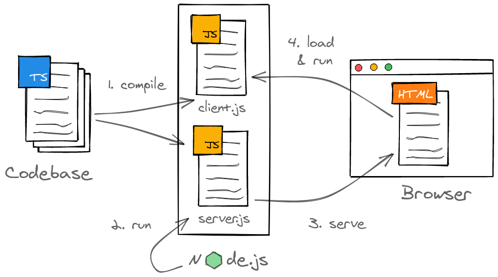

```toc

```

In this article I'll show you how to setup a fullstack TypeScript web application project that uses Node.js and React with server-side rendering (SSR). In the end, we'll have a clean, fast and fully type-safe build with a convenient development mode.

As always, the code from this article is [available on GitHub](https://github.com/nilsmehlhorn/ts-react-ssr-webpack).

## Concept

The following sketch shows you how everything is going to fit together in the end. Our source code will consist out of TypeScript files which we'll compile into two separate JavaScript "bundles" - basically singular files representing an application. One application will be our server running inside Node.js and responding to HTTP request with server-side rendered HTML documents. The other one will run in a user's browser and enhance these HTML documents with interactivity via React.



You might've notice that React isn't directly part of the concept sketch. That's because it isn't integral too the setup itself but rather "just" a library for rendering HTML. Usually, this HTML is described with the XML-like syntax extension for JavaScript called [JSX](https://reactjs.org/docs/introducing-jsx.html). In practice, any JSX can be replaced with corresponding calls to `React.createElement()`:

```jsx
// create React element with JSX
const element = <h1 className="greeting">Hello, world!</h1>

// create React element through API
const element = React.createElement(
  'h1',
  { className: 'greeting' },
  'Hello, world!'
)
```

As long as we factor in a step in our setup where we perform such a replacement, we'll be fine.

## Considerations

For many - myself included - build setups can seem [confusing](https://twitter.com/jaffathecake/status/878160747909365761), especially when webpack configurations are involved. I'm hoping to demystify the topic as much as possible, however, I think that it's worth mentioning some alternatives.

First off, there are various bundler options (e.g. [Parcel](https://parceljs.org/), [Brunch](https://brunch.io/), [snowpack](https://www.snowpack.dev/) or [rollup.js](https://rollupjs.org/guide/en/)). While some of them might be easier to configure or yield better results (e.g. regarding bundle size), I'll stick with [webpack](https://webpack.js.org/) because it works for both client and server bundles while arguably being the most battle-tested solution with the biggest community.

On the other hand, you can get similar results without doing any configuration yourself and instead rely on frameworks like [Next.js](https://nextjs.org/).

Nevertheless, as you're about to see, configuring a proper setup yourself is also a viable solution that gives you more flexibility and helps you understand all involved parts. I'm currently working on a [new application](https://sendlater.cemble.com/) where we started with a rather simple Node.js setup and evolved it along our feature requirements. Approaching projects like this allows you to deliver value fast and not get lost in analysis paralysis.

## Prerequisites

- [Install Node.js](https://nodejs.org/en/download/) (I'm using Node.js v14 here)
- Setup an empty Node.js project either with `npm init` or by creating a [`package.json`](https://docs.npmjs.com/cli/v6/configuring-npm/package-json) yourself

## Running TypeScript in Node.js

The Node.js server runtime only understands JavaScript - [roughly ES2015](https://node.green/) in either the CommonJS or ES module format, to be specific. However, for any mildly sophisticated project (or ones that might evolve into such) you're better off writing code in TypeScript. Type-safety has positive effects on maintainability - there's [scientific evidence](https://dl.acm.org/doi/10.1145/2816707.2816720) for that.

Consequently, we can't run our TypeScript code directly but rather have to compile it into JavaScript and then run the result inside Node.js. We'll do this by levering the TypeScript compiler which you can install as a development dependency with the following command:

```bash
npm install --save-dev typescript
```

Let's create a basic server using the [Express](https://expressjs.com/) web framework in order to have something to compile. Express adds a small layer on-top of the regular Node.js APIs to make writing server-side web applications more convenient. You can install it as a regular depencency as follows:

```bash
npm install --save express
```

You'll also want to install type definitions for Node.js an Express so that TypeScript can understand their modules properly:

```bash
npm install --save-dev @types/node @types/express
```

Again, there are a bunch of alternatives to Express (e.g. [Fastify](https://www.fastify.io/)) or higher-level frameworks (e.g. [NestJS](https://nestjs.com/)) available which you're free to choose instead. And again, I'm going with the most popular option for the sake of simplicity.

Finally, create the directory `server/` and inside it the file `server.ts`. This file corresponds with the `server.js` file from the concept sketch and represents the entry point for our server application. Initially, it has the following contents:

```typescript
// server/server.ts
import express from 'express'

const server = express()

server.get('/', (req, res) => {
  res.send('Hello from Server')
})

server.listen(3000, () => {
  console.log(`Server running on http://localhost:3000`)
})
```

Here we create an Express server instance by invoking the default export of the `'express'` module. We can then register any HTTP endpoints on this server and specify what to do once a request comes in via a callback function. In our case, we'll have a single endpoint responding with some plain text to a GET request on the root path. After that we'll startup the server with the [`listen()`](https://expressjs.com/de/api.html#app.listen) function while passing a port and a callback that'll be invoked once our server is running.

We'll then create a TypeScript compiler configuration in the file `tsconfig.server.json` for building our server-side code:

```json
// tsconfig.server.json
{
  "include": ["server"], // compile TS files in server directory
  "compilerOptions": {
    "module": "commonjs", // classic format that Node.js understands
    "esModuleInterop": true, // allow imports of modules in ES format
    "skipLibCheck": true, // only check types we refer to from our code
    "forceConsistentCasingInFileNames": true, // prevents cross-OS problems
    "resolveJsonModule": true, // enable import of JSON files
    "lib": ["es6"], // use JavaScript API ES6
    "target": "es6", // compile to ES6
    "jsx": "react", // compile JSX to React.createElement statements for SSR
    "allowJs": true, // allow import of JS modules
    // enable strict type checking
    "strict": true,
    "strictNullChecks": true,
    "noImplicitAny": true
  }
}
```

I've add a little comment explaining each compiler option. You can get the full explanation for each from the [documentation](https://www.typescriptlang.org/tsconfig). Note that `jsx` option allows us to compile any JSX (or [TSX](https://www.typescriptlang.org/docs/handbook/jsx.html)) expressions into plain `React.createElement()` statements.

In order to run the compilation we can add an npm script to the `package.json` which should then look as follows:

```json
{
  "name": "ts-react-webpack-ssr",
  "version": "1.0.0",
  "scripts": {
    "build:server": "tsc --project ./tsconfig.server.json --outDir ./dist",
    "start": "node ./dist/server.js"
  },
  "devDependencies": {
    "@types/express": "^4.17.11",
    "@types/node": "^14.14.35",
    "typescript": "^4.2.3"
  },
  "dependencies": {
    "express": "^4.17.1"
  }
}
```

Executing the `build:server` script as follows will give us a ready-to-run JavaScript file `server.js` in the `dist/` directory that can be understood by Node.js:

```bash
npm run build:server
```

Afterwards, we can startup this server with the `start` script which in turn invokes the Node.js CLI:

```
npm start
```

## Bundle TypeScript for Node.js with webpack

Technically, we could almost leave it at that for the server-side code and keep building directly with the TypeScript compiler. However, there are certain reasons to also use a bundler for Node.js code:

- once your codebase grows, you'll have a JavaScript output file for each TypeScript source file - that's not too bad, but working with a single output file like we'd get from a bundler is generally easier in my opinion
- we'll be using a bundler for the frontend application (the `client.js` part) anyway
- using webpack for both bundles will enable a convenient development mode
- we'll get performance optimizations like minification

We'll start setting up webpack for our server by installing the required tooling:

```bash
npm install --save-dev webpack webpack-cli ts-loader webpack-node-externals
```

We'll make use of these packages in a webpack configuration exported in the CommonJS format from `webpack.config.js`:

```js
// webpack.config.server.js
const nodeExternals = require('webpack-node-externals')
const path = require('path')

module.exports = {
  name: 'server',
  entry: {
    server: path.resolve(__dirname, 'server/server.ts'),
  },
  mode: 'production',
  output: {
    path: path.resolve(__dirname, 'dist'),
    filename: '[name].js',
  },
  resolve: {
    extensions: ['.ts', '.tsx'],
  },
  externals: [nodeExternals()],
  target: 'node',
  node: {
    __dirname: false,
  },
  module: {
    rules: [
      {
        test: /\.tsx?$/,
        loader: 'ts-loader',
        options: {
          configFile: 'tsconfig.server.json',
        },
      },
    ],
  },
}
```

Let's go through each option here, again checkout the [documentation](https://webpack.js.org/configuration/) for more details.

Inside the `entry` property we define an entry point for the server bundling, usually that's where the application should start. Setting `mode` to `'production'` instructs webpack to run all kinds of build optimizations. Via `output` we specify where webpack should put resulting files - in our case that's in the `dist/` directory where `[name]` will be replace with the key from the `entry` dictionary.

While bundling, we'll `resolve` all files with TypeScript or TSX. Once resolved, we'll leverage the `ts-loader` to compile TypeScript code based on our existing compiler configuration.

Passing `webpack-node-externals` to the `externals` property will make webpack skip bundling files from the `node_modules` directory and instead import them at runtime. That's necessary because certain Node.js dependencies can't be bundled. Our compilation `target` is the Node.js runtime. Setting `node.__dirname` to `false` keeps the special [`__dirname`](https://nodejs.org/docs/latest/api/globals.html) path variable working as expected after the bundling.

Lastly, adapt our `build:server` script to invoke the webpack CLI:

```json
// package.json
{
  "build:server": "webpack --config webpack.config.server.js"
}
```

That's it for our server build - onto the client-side!

## React SSR Setup with webpack and TypeScript

First, we'll install React and corresponding type declarations:

```bash
npm install react react-dom
npm install --save-dev @types/react @types/react-dom
```

Then we create a separate directory `client/` for our client-side thus React code. I'll write a simple React component representing the frontend app inside `app.tsx`:

```tsx
// client/app.tsx
import React from 'react'

export const App: React.FC = () => <p>Hello from Client</p>
```

Usually, you'd render this React component into the DOM with [`ReactDOM.render()`](https://reactjs.org/docs/react-dom.html#render). However, we're building a server-side rendered application where the client doesn't need to perform an initial HTML render. Instead, we only need to attach our React component to existing HTML which can be done with [`ReactDOM.hydrate()`](https://reactjs.org/docs/react-dom.html#hydrate) as follows:

```tsx
// client/client.tsx
import React from 'react'
import ReactDOM from 'react-dom'
import { App } from './components/app'

ReactDOM.hydrate(<App />, document.getElementById('root'))
```

In order to compile a client-side bundle out of this code, we'll have to define another set of TypeScript and webpack configurations:

```json
// tsconfig.client.json
{
  "include": ["client"],
  "compilerOptions": {
    "module": "es6", // generate ES modules
    "target": "es5", // target ES5 API
    "jsx": "react", // compile JSX to React.createElement statements for browser
    "allowSyntheticDefaultImports": true,
    "forceConsistentCasingInFileNames": true,
    "skipLibCheck": true,
    "resolveJsonModule": true,
    "strict": true,
    "strictNullChecks": true,
    "noImplicitAny": true
  }
}
```

Before writing the webpack configuration, we'll install two plugin: one that allows us to clean the output directory before each build and another one that generates a JSON file with information about the build output:

```bash
npm install --save-dev clean-webpack-plugin webpack-manifest-plugin
```

The configuration can look as follows:

```js
// webpack.config.client.js
const path = require('path')
const { CleanWebpackPlugin } = require('clean-webpack-plugin')
const { WebpackManifestPlugin } = require('webpack-manifest-plugin')

module.exports = {
  name: 'client',
  entry: {
    client: path.resolve(__dirname, 'client/client.tsx'),
  },
  mode: 'production',
  output: {
    path: path.resolve(__dirname + '/dist/static'),
    filename: '[name].[contenthash].js',
    publicPath: '',
  },
  resolve: {
    extensions: ['.ts', '.tsx', '.js'],
  },
  target: 'web',
  module: {
    rules: [
      {
        test: /\.tsx?$/,
        loader: 'ts-loader',
        options: {
          configFile: 'tsconfig.client.json',
        },
      },
    ],
  },
  plugins: [new CleanWebpackPlugin(), new WebpackManifestPlugin()],
}
```

A lot of this should be familiar from the server bundle configuration. The major differences are that we're starting at `client/client.tsx` and outputting to `/dist/static` while compiling for the web as well as including a hash of the contents in the filename - the last bit is meant to prevent unwanted browser [caching](https://webpack.js.org/guides/caching/).

The `clean-webpack-plugin` removes any obsolete build artifacts resulting from including the hash. Meanwhile, the `webpack-manifest-plugin` generates a JSON file called `manifest.json` in the output directory from which we can gather the filename of latest built bundle. This will help us to serve HTML from the server. It'll look something like this:

```json
// dist/static/manifest.json
{
  "client.js": "client.f34004c91fb1606d0364.js"
}
```

Here's another npm script for invoking the client bundling:

```json
// package.json
{
  "build:client": "webpack --config webpack.config.client.js"
}
```

## Serve React SSR from Node.js

We've now successfully setup builds for the server and client applications. The only things left to do is rendering HTML on the server while referencing the client-side bundle from that HTML.

Right now, our server only has a single endpoint that responds with a simple message. That's where we'd now like to send HTML instead. We could technically generate this HTML through string concatenation, however, using a template engine like [EJS](https://ejs.co/) is generally more convenient:

```bash
npm install ejs
```

We'll define a template with an HTML skeleton where we can include some HTML from the React server-side rendering as well as reference the client-side bundle for the rehydration. The following template expects the HTML to reside in a `component` template attribute while another attribute `assets` contains a property `client-js` with the public path to the client-side bundle (the one with the dynamic hash):

```ejs
<!-- server/views/client.ejs -->
<!DOCTYPE html>
<html>
  <head>
    <meta charset="utf-8" />
    <title>React + Node.js App</title>
  </head>
  <body>
    <div id="root"><%- component %></div>
    <script defer="defer" src="<%= assets["client.js"] %>"></script>
  </body>
</html>
```

It's necessary to now also add the webpack copy plugin to our server bundling so that this template is available at a relative location to the resulting JavaScript code:

```js
// webpack.config.server.js
const CopyPlugin = require('copy-webpack-plugin')

module.exports = {
  /* config */
  plugins: [
    new CopyPlugin({
      patterns: [{ context: 'server', from: 'views', to: 'views' }],
    }),
  ],
}
```

Next up, we register EJS as Express's [view engine](https://expressjs.com/en/guide/using-template-engines.html) and tell it to look for view templates in the `view/` directory. Also, we'll setup the `express.static` middleware to serve any files from `./static` - that's where the client bundle resides when both server and client are built.

```ts
// server/server.ts
import express from 'express'
import fs from 'fs'
import path from 'path'
import React from 'react'
import ReactDOMServer from 'react-dom/server'
import { App } from '../client/components/app'

server.set('view engine', 'ejs')
server.set('views', path.join(__dirname, 'views'))

server.use('/', express.static(path.join(__dirname, 'static')))

const manifest = fs.readFileSync(
  path.join(__dirname, 'static/manifest.json'),
  'utf-8'
)
const assets = JSON.parse(manifest)

server.get('/', (req, res) => {
  const component = ReactDOMServer.renderToString(React.createElement(App))
  res.render('client', { assets, component })
})
```

Then we parse the manifest generated by webpack as preparation for the server-side rendering that'll now take place in the GET handler.

Note that you shouldn't use synchronous operations like [`fs.readFileSync()`](https://nodejs.org/api/fs.html#fs_fs_readfilesync_path_options) once your server is running. Instead use asynchronous counterparts like [`fs.readFile()`](https://nodejs.org/api/fs.html#fs_fs_readfile_path_options_callback) or [`fsPromises.readFile()`](https://nodejs.org/api/fs.html#fs_fspromises_readfile_path_options) so that the [Node.js event loop won't be blocked](https://nodejs.org/en/docs/guides/dont-block-the-event-loop/). Here it's fine to make an exception because we're doing it during startup and we want to make sure that the file can be loaded before the server starts.

Now, when a GET request is made to `http://localhost:3000`, we'll leverage React's utility for server-side rendering [`ReactDOMServer.renderToString()`](https://reactjs.org/docs/react-dom-server.html#rendertostring). We can pass a React element into it and it'll return the corresponding HTML. Together with the parsed manifest, we'll feed this into the `client.ejs` template via [`res.render()`](https://expressjs.com/de/api.html#res.render) to complete step 3 from our concept.

Execute the following commands and you'll have a server-side rendered React and Node.js app running:

```bash
npm run build:client
npm run build:server
npm start
```

## Development Mode & Debugging

During development you'll likely want to re-compile and restart your server upon any changes to the source code. We can facilitate this for our setup with a little development script. As a prerequisite, install the `cross-spawn` package for spawning child processes properly on any OS:

```bash
npm install --save-dev cross-spawn
```

Then, we'll create the file `dev.js` for housing our script. Inside, we'll leverage webpack's Node.js API, specifically its [MultiCompiler](https://webpack.js.org/api/node/#multicompiler). It allows us to combine multiple webpack configurations into one compiler process. Note that I'm adapting our configurations with the spread operator beforehand. This way we can opt-out of webpack's optimizations, enable sourcemaps for debugging and even remove the hash from the client bundle:

```js
// dev.js
const spawn = require('cross-spawn')
const path = require('path')
const webpack = require('webpack')
const webpackConfigClient = require('./webpack.config.client')
const webpackConfigServer = require('./webpack.config.server')

const compiler = webpack([
  {
    ...webpackConfigClient,
    mode: 'development',
    devtool: 'source-map',
    output: {
      ...webpackConfigClient.output,
      filename: '[name].js',
    },
  },
  {
    ...webpackConfigServer,
    mode: 'development',
    devtool: 'source-map',
  },
])

let node

compiler.hooks.watchRun.tap('Dev', (compiler) => {
  console.log(`Compiling ${compiler.name} ...`)
  if (compiler.name === 'server' && node) {
    node.kill()
    node = undefined
  }
})

compiler.watch({}, (err, stats) => {
  if (err) {
    console.error(err)
    process.exit(1)
  }
  console.log(stats?.toString('minimal'))
  const compiledSuccessfully = !stats?.hasErrors()
  if (compiledSuccessfully && !node) {
    console.log('Starting Node.js ...')
    node = spawn(
      'node',
      ['--inspect', path.join(__dirname, 'dist/server.js')],
      {
        stdio: 'inherit',
      }
    )
  }
})
```

The webpack compiler offers certain hooks for tapping into the compilation process. We'll use the `watchRun` hook to terminate any previous Node.js server once the source files change and a re-compilation starts.

Calling `compiler.watch()` will then start the webpack compilation in [watch mode](https://webpack.js.org/configuration/watch/). The callback passed as the last parameter will be invoked after each re-compilation. If there aren't any critical errors with webpack itself, we'll log the [build stats](https://webpack.js.org/configuration/stats/). After that, given the compilation was successful, we'll restart the server by invoking the Node.js CLI through `cross-spawn`. Setting `stdio` to `'inherit'` ensures that we'll see the log output from our server.

The `--inspect` flag will make Node.js expose a [debugger](https://nodejs.org/en/docs/guides/debugging-getting-started/). As an example, you can attach to this debugger with Visual Studio Code with the following launch configuration:

```json
// .vscode/launch.json
{
  "version": "0.2.0",
  "configurations": [
    {
      "type": "node", // debug Node.js
      "name": "Attach Node Debugger",
      "request": "attach", // only attach to existing, don't launch
      "sourceMaps": true, // look for source maps
      "restart": true, // restart when loosing connection due to re-compile
      // look for source-maps based on our bundle result
      "outFiles": ["${workspaceFolder}/dist/server.js"]
    }
  ]
}
```

Note that you can also use `--inspect-brk` instead to have Node.js wait for the debugger to attach.

## What's next

I think this setup itself is already a decent basis for building server-side rendered thus SEO-friendly web applications with good performance.

I'll address further extensions and improvements in follow-up posts, right now I'm thinking of the following:

- SCSS integration with CSS modules
- Performance improvements via library replacements
- Integration with React routing

Leave a comment below if anything is unclear or you have a suggestion for improving the setup.