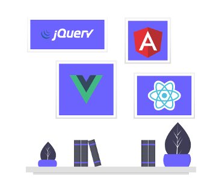
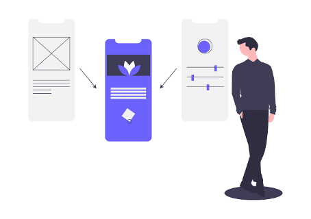

The famous scripting language has come a long way since it's
introduction in 1995. While it might not be everyone's favourite, it
seems to get more fans by the day, even ranking as the
[most popular
language on StackOverflow](https://insights.stackoverflow.com/survey/2019#technology).
Originally intended to provide interactivity on websites by building
upon HTML and CSS, nowadays, you can use JavaScript for almost anything
you can imagine yourself doing with computers - though it might be a
different question, whether that's always a great idea. Lets have a look
at real world use-cases where JavaScript is a good fit today.

## Web Development

Surprise, surprise: you can build websites with JavaScript. In recent
years single-page applications built with
[React](https://reactjs.org/),
[Angular](https://angular.io/) or
[Vue.js](https://vuejs.org/) became the somewhat of a norm - gradually
replacing server-side rendered websites which might have used
[jQuery](https://jquery.com/) for interactive components.

The web development environment is often
[criticized for its
high speed of change](https://dayssincelastjavascriptframework.com/)
where frameworks have tiny life spans. While there might have been some
eventful times, this is actually kind of unfounded when looking at the
numbers. React was released in 2013 and is now more alive than ever. So
is Angular which just turned 3 years old building upon its predecessor
[AngularJS](https://angularjs.org/) initially released in 2010. Vue.js
was also released over 5 years ago in 2014.

If you don't like the baggage you get by using a single-application
framework you might just leave them behind. With the introduction of
[web components](https://developer.mozilla.org/en-US/docs/Web/Web_Components),
modern JavaScript and advanced build tools you could build your apps
framework-less - have a look at the
[Polymer Project](https://www.polymer-project.org/).
 
Not only can you built full-fledged web apps with JavaScript but also
quite nicely use it to generate static sites. You might leverage a
pragmatic solution such as
[Eleventy](https://www.11ty.io/) or bring frameworks back into the game.
With
[Gatsby](https://www.gatsbyjs.org/) and
[Next.js](https://nextjs.org/) as well as
[VuePress](https://vuepress.vuejs.org/) and
[Nuxt.js](https://nuxtjs.org/) you get the benefits of using React or
Vue.js respectively whilst generating lightweight static pages - like
this blog which is
[made with Gatsby](https://github.com/nilsmehlhorn/blog).

## Desktop Apps

Desktop apps are frequently built using the JavaScript framework
[Electron](https://electronjs.org/). It works by packaging your
application with an instance of the Chromium browser and the Node.js
JavaScript server allowing for rich user experiences - like it's
powering the popular code editor
[Visual Studio Code](https://code.visualstudio.com/). Sadly the approach
will result in a minimal bundle size of about
[100MB](https://github.com/electron/electron/issues/2003).

If that's too heavy for your taste you can try solutions like
[Vuido](https://vuido.mimec.org/) or
[Proton Native](https://proton-native.js.org/) - but you might not have
to!

The web is getting increasingly powerful forming a new era of
[progressive web apps](https://developers.google.com/web/progressive-web-apps).
They can be launched from a users desktop or home screen and obtain a
similar feel as native applications. Through modern web APIs you can
[send push
notifications](https://developer.mozilla.org/en-US/docs/Web/API/Push_API),
[connect Bluetooth devices](https://developer.mozilla.org/en-US/docs/Web/API/Web_Bluetooth_API)
or
[create offline experiences](https://developer.mozilla.org/en-US/docs/Web/API/Service_Worker_API).

## Mobile App Development

Progressive web apps might not be quite ready enough for your needs.
Yet, you might still build your native apps with JavaScript. Frameworks
like
[NativeScript](https://www.nativescript.org/) and
[React Native](https://facebook.github.io/react-native/) will allow you
to write your app code in JavaScript while providing a native user
experience allowing you to use everything that the platform is offering.
They do this by running your code in the JavaScript engine of your iOS
or Android phone and providing bridges to native interfaces. 

Meanwhile you might repurpose your framework knowledge with React Native
or by combining NativeScript with Angular or Vue.js (support for React
is also 
[on the way](https://github.com/shirakaba/react-nativescript)). Bonus:
both solutions enable you to share code between mobile and web thereby
making it possible to deliver on a range of platforms from just one
JavaScript code base.

Personally, I really like showing people the
[NativeScript Playground](https://play.nativescript.org/) as it
impressively illustrates how easy you can get up and running with a
native app powered by JavaScript.

## Servers and APIs

Most apps need some kind of backend - and you can build that with
JavaScript as well! With
[Node.js](https://nodejs.org/en/) you'll get a fast and scalable
JavaScript runtime for building servers. For a long time
[Express](http://expressjs.com/) has been the go-to framework for
server-rendered web applications or APIs. While it still might be the
most popular, others are catching up.
[Koa](https://koajs.com/) poses as a smaller and more expressive
successor while
[hapi](https://hapi.dev/) shows a strong focus on security. Others like
[Nest.js](https://nestjs.com/) can be layered on top to create solid
architectures.

Whether you'd like to set up REST or GraphQL APIs, open a web socket or
just render some HTML - you can do it with JavaScript and Node.js. This
way you might lay ground for your next productivity app, realtime
collaboration tool, chat room or streaming service.

## Game Development

The language is already very UI-oriented due to its origin. So you can
make simple browser games just with JavaScript, HTML and CSS. When
things get more complex, you might decide to
[use the HTML Canvas for
2D rendering](https://developer.mozilla.org/en-US/docs/Games/Tutorials/2D_Breakout_game_pure_JavaScript).
There are also some designated game development frameworks for making
your life easier such as
[Phaser](http://phaser.io/) or
[PixiJS](https://www.pixijs.com/). However, if you're developing a
graphics-intense tool you might like
[Konva](https://konvajs.org/) - it's what we currently use at
[SceneLab](https://scenelab.io/).

Want to make 3D games? You're in luck! Browsers have their very own 3D
graphics interface called
[WebGL](https://developer.mozilla.org/en-US/docs/Web/API/WebGL_API).
Using it yourself can be bit overwhelming though. Instead you might be
better off using a framework to be more productive.
[Babylon.js](https://www.babylonjs.com/) and
[Three.js](https://threejs.org/) are household names for doing anything
3D-related on the web. If you'd like something more focused on games you
might like
[PlayCanvas](https://playcanvas.com) which also comes with a
browser-based editor. Otherwise you can also use established game
engines such as
[Cocos2d.x](https://cocos2d-x.org/cocos2dx) with JavaScript bindings to
develop cross-platform games.

But wait there's more: the
[WebXR standard](https://developer.mozilla.org/en-US/docs/Web/API/WebXR_Device_API)
(formerly WebVR) brings JavaScript-based games to the next level by
allowing you to access virtual and augmented reality devices. This means
you can create immersive VR/AR experiences with JavaScript! You can use
one of the mentioned 3D framworks or have a look at
[A-Frame](https://aframe.io/).

## Machine Learning

That's right, you don't need to learn Python in order to get into
machine learning - JavaScript will do! With
[TensorFlow.js](https://www.tensorflow.org/js) you can develop machine
learning models for image classification, audio recognition or
predictive analytics. The best thing: you can either do that on Node.js
or right in browsers! Machine learning is a very GPU-intensive task,
however, it can run hardware-accelerated in the browser through WebGL.
This way you might create a recommendation system that runs completely
client-side without the need for expensive servers all while mitigating
privacy concerns.

If you're not too fond of TensorFlow, you might like
[brain.js](https://github.com/BrainJS/brain.js) for training neural
networks or
[ml.js](https://github.com/mljs/ml) which comes with a multitude of
different machine learning algorithms. Both also allow you to train and
run your algorithms inside the browser.

## Internet of Things

Affordable hardware is getting evermore available giving you an easy way
into the world of microcontrollers. While you're usually required to
learn languages like C or C++ to build smart systems you could also just
stick with JavaScript!

The
[Johnny-Five](http://johnny-five.io/) platform provides an approachable
API for a variety of Arduino boards. If you're more into robots you
could have a look at
[Cylon.js](https://cylonjs.com/). Both work by translating your
JavaScript to something the device can understand. Inevitably this
restricts you from deploying your controller without having another
machine with Node.js running somewhere next to it.

This is not necessary with
[JerryScript](https://jerryscript.net/) which is a designated JavaScript
runtime for microcontrollers - it merely needs 64KB of RAM. Be warned
though as you might still need to get into the weeds with different
tools depending on your use-case. Eventually the Internet of Things might be a rather
experimental application area for JavaScript - though it's often leveraged for corresponding backend services using [MQTT](https://github.com/mqttjs/MQTT.js).

## Wrapping Up

As we've seen there's a wide variety of use-cases you can cover with
JavaScript while building upon a huge community and solid projects. This
is a great thing because it empowers you to be creative in many
different ways using a language you might already know.

Are there any interesting use-cases I didn't cover? Leave a comment to
let me know!

