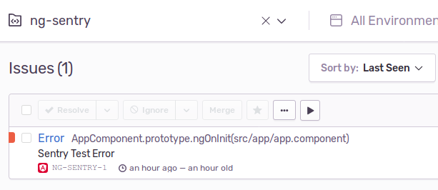

Do you know what's going on in your Angular app when it's live? While
common to have logging set up on the server-side, it's often dismissed
on the client-side. Yet, with more and more logic taking place in the
user's browser nowadays we might want to keep a grip on the quirks our
code might come up with in production.

## Users won't contact you, they'll leave

As harsh as it sounds, without monitoring you're effectively assuming
everything's working fine unless told otherwise. But be honest here for
a second. When was the last time you clicked 'Submit Error Report' after
an app on your phone crashed? And when there's no such reporting
mechanism in place? Expecting users do draft up a detailed e-mail
including what they did prior and which version of what browser they're
using is, well, pretty optimistic. If something doesn't work, you'll try
something else. Apps are mostly productivity tools. User's won't spend
one more second on something that's supposed to save _them_ time.

## console.log won't get you far

Although there's some controversy on
[when to log or when to debug](https://twitter.com/BenLesh/status/1151404250586669056),
the browser console is definitely a useful tool during development.
However, everything you `console.log` stays inside your browser and once
you deploy your application it won't run in just _your_ browser anymore.
You don't have access to people's browser console and therefore lose
those precious stack traces which might've helped to fix a nasty bug.

Besides, mindlessly shoving stuff in the console won't benefit but
rather just
[slow your app down](https://jsperf.com/console-log1337/14). Also - like
any JavaScript API - the console isn't exempted from
[compatibility issues](https://developer.mozilla.org/en-US/docs/Web/API/Console#Browser_compatibility).
So some feature's might not work everywhere - though you could probably
polyfill them, but don't do that. Instead, deploy a proper solution.

## Using Sentry in your Angular app

[Sentry](https://sentry.io) is an
[open-source](https://github.com/getsentry/sentry) error tracking
solution that'll allow you to log errors beyond the browser console. You
can
[run your own server](https://docs.sentry.io/server/) or use the
[hosted variant](https://sentry.io/pricing/) (there's a free tier and if
you're a student, you can also benefit from the
[GitHub Student Pack](https://education.github.com/pack)).

Once you've got either variant ready, you can install the JavaScript SDK
by running 

```shell script
npm i --save @sentry/browser
```
Then you'll implement Angular's
[ErrorHandler](https://angular.io/api/core/ErrorHandler) interface like
follows. You'll need the data source name (DSN) of your project for
this, which will tell Sentry where to forward the errors.

```typescript
import { Injectable, ErrorHandler} from '@angular/core'
import * as Sentry from '@sentry/browser'

@Injectable()
export class SentryErrorHandler implements ErrorHandler {
  
  constructor() {
    Sentry.init({
      dsn: '<your-sentry-project-dsn>'
    })
  }
  
  handleError(error) {
    Sentry.captureException(error.originalError || error)
  }
}
```

By implementing this interface we're able to catch all errors that occur
in our application at a central point. This is enabled by
[zone.js](https://github.com/angular/angular/tree/master/packages/zone.js)
which is used by Angular to wrap our app code and thus hook into any
errors thrown. Now we just have to tell Angular to use our error handler
instead of the default one - which would just log to the console. We do
this by providing our error handler in the `app.module.ts`:

```typescript
import { ErrorHandler } from '@angular/core'
import { SentryErrorHandler} from './error-handler'

@NgModule({
  ...
  providers: [
    {provide: ErrorHandler, useClass: SentryErrorHandler}
  ]
})
export class AppModule { }
```

Now any error thrown during runtime will show up inside Sentry. You
might want to test this by just throwing an error somewhere in your
code, e.g. in `ngOnInit` of your `app.component.ts`:

```typescript
@Component({...})
export class AppComponent implements OnInit {

    ngOnInit(): void {
        throw new Error('Sentry Test Error') // TODO: remove
    }
}
``` 

It should show up in your Sentry dashboard like this:

<strong>

</strong>

## Dealing with environments

There are some easy steps we can complete which will make our handling a
bit more sophisticated. One thing you might have noticed is, that once
you replace the default error handler, errors won't show up in the
console anymore. We probably want those back for development purposes.
Therefore we'll only provide our error handler in production
[environments](https://angular.io/guide/build) by leveraging a provider
factory:

```typescript
import { ErrorHandler } from '@angular/core'
import * as Sentry from '@sentry/browser'
import { environment } from './../environments/environment'

class SentryErrorHandler implements ErrorHandler { ... }

export function getErrorHandler(): ErrorHandler {
  if (environment.production) {
    return new SentryErrorHandler()
  }
  return new ErrorHandler()
}
```

We can now use the factory to encapsulate the handler provision like
this:

```typescript
import { ErrorHandler } from '@angular/core'
import { getErrorHandler} from './error-handler'

@NgModule({
  ...
  providers: [
    {provide: ErrorHandler, useFactory: getErrorHandler}
  ]
})
export class AppModule { }
```

Also, if you've got multiple environments which should forward errors to
Sentry but don't want them to get mixed up, you can
[tell Sentry about
the environment](https://docs.sentry.io/enriching-error-data/environments/?platform=browser)
it's running in during initialization. For that purpose we can maintain
a property for the environment's name inside our `environment.<name>.ts`
and pass it along:

```typescript
class SentryErrorHandler implements ErrorHandler { 
  
  constructor() {
    Sentry.init({
      dsn: '<your-sentry-project-dsn>',
      environment: environment.name
    })
  }

...
```

## Providing context

A stack trace on its own is sometimes not enough to figure out why
something went wrong. Sentry will additionally provide you with
information about the user's browser, operating system as well as ip
address. It'll also show you the url the user was on when the error
occurred.

If you'd like to add more information, you can do so by modifying
Sentry's
[scope](https://docs.sentry.io/enriching-error-data/scopes/?platform=browser).
This way you could include the currently authenticated user in the error
report:

```typescript
const user = this.getUser() // get's user from some service
Sentry.configureScope(scope => {
  scope.setUser({
    id: user.id,
    username: user.name,
    email: user.mail,
  })
})
```

One thing that might trip you up here is getting the user inside your
error handler. You'd usually do this through injection of a service
(e.g. your
[NgRx Store](https://ngrx.io/guide/store)). Yet, if you try injecting
into the error handler, you'll end up with this error: `Provider parse
errors: Cannot instantiate cyclic dependency!`

Since the error handler is an integral part of any Angular application,
it's loaded at the very beginning before any of your regular services.
It therefore can't depend directly on such services. You might get
around this by depending on Angular's
[Injector](https://angular.io/api/core/Injector) and
[fetching the
required service lazily](https://angular.io/api/core/Injector#example-1)
in the `handleError` method. Yet, it might be cleaner to instead move
the scope configuration out of our handler completely. Thus we'd
configure the scope directly in response to a successful login. Not only
would this resolve the cyclic dependency, it'd also minimize code in our
error handler. This way it's less likely that we'll cause additional
errors _while_ reporting errors - possibly causing an endless loop. We
can create a monitoring service for this purpose, which could look like
this:

```typescript
import { Injectable} from '@angular/core'
import * as Sentry from '@sentry/browser'

@Injectable({providedIn: 'root'})
export class MonitoringService {
  
  monitorUser(user: User): void {
    Sentry.configureScope(scope => {
      scope.setUser({
        id: user.id,
        username: user.name,
        email: user.mail,
      })
    })
  }
}
```

With this setup we can also easily test that `monitorUser` - and thus
the scope configuration - is called from another service through
[dependency
injection](https://angular.io/guide/testing#services-with-dependencies).

Besides attaching the user, you can also put
[key-value pairs](https://docs.sentry.io/enriching-error-data/context/?platform=browser#tagging-events)
into the scope or set a
[severity level](https://docs.sentry.io/enriching-error-data/context/?platform=browser#setting-the-level).
It's also possible to provide arbitrary
[extra content](https://docs.sentry.io/enriching-error-data/context/?platform=browser#extra-context)
which might help you to reproduce a user's workflow. But watch out
before dumping the whole application state because this field will
only hold up to 200kB.

## Bottom line

It's usually common sense to have some kind of monitoring for your
applications. Yet, for browser applications this has been somewhat
dismissed - probably because there weren't any sophisticated solutions
like there have been for native mobile apps (e.g.
[Crashlytics](https://firebase.google.com/products/crashlytics)).
 
Sentry and alike let you gain insight into what's going on in your
Angular app and therefore develop with more confidence. And, with the
presented considerations we were able to integrate it the Angular
way.

There's also a bunch of other stuff you can do with Sentry such as
[collecting user feedback upon error](https://docs.sentry.io/enriching-error-data/user-feedback/?platform=browser)
or tracking errors against releases and automatically filing bugs.
