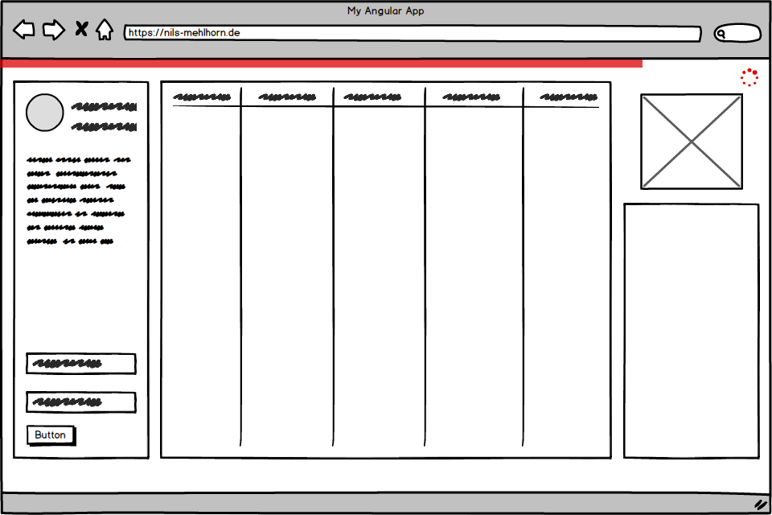

Its a common desire: having something rotate or fly around to entertain the user while the moderately performing backend
fishes data from god knows where. Though it seems easy to borrow a [spinner from CodePen](https://codepen.io/search/pens?q=spinner)
 and display it while you make the server roundtrip, there are some common misconceptions and pitfalls that 
 we'll clear up.

## Waiting for data

Let's start with a routine task: we want to display a list of users which is fetched asynchronously through a service.
An inexperienced, yet technically fine, solution could look as follows: 
``` typescript
export class UserComponent implements OnInit  {

  users: User[]
  loading = false

  constructor(private userService: UserService) {}

  ngOnInit(): void {
    this.loading = true
    this.userService.getAll().pipe(
      finalize(() => this.loading = false)
    ).subscribe(users => this.users = users)
  }
}
```
An instance variable is used for holding the users and another one for a flag indicating whether the users are 
still loading or have already arrived. Before subscribing - and thus kicking of the asynchronous call - the loading flag is updated.
After the call completes, it's reset through the use of the `finalize` operator. The callback passed to this operator will
be called after the observable call completes - regardless of its result. If this was rather just done inside the
subscription callback, the loading flag would only reset after a successful call and not in case of an error.
A corresponding view could look like this:
``` html
<ul *ngIf="!loading">
  <li *ngFor="let user of users">
    {{ user.name }}
  </li>
</ul>
<loading-indicator *ngIf="loading"></loading-indicator>
```
Yet, for most calls which provide data to be displayed directly into a view, this setup can be simplified using 
the [AsyncPipe](https://angular.io/api/common/AsyncPipe). Our component will be shortened to the following:

``` typescript
export class UserComponent implements OnInit  {

  users$: Observable<User[]>

  constructor(private userService: UserService) {}

  ngOnInit(): void {
    this.users$ = this.userService.getAll()
  }
}
```
Now the component directly exposes the stream of users to the view. We'll update the view using the `async as` syntax to 
bind the stream's value to a separate `users` variable once it emits:
``` html
<ul *ngIf="users$ | async as users; else indicator">
  <li *ngFor="let user of users">
    {{ user.name }}
  </li>
</ul>
<ng-template #indicator>
  <loading-indicator></loading-indicator>
</ng-template>
```
By providing a view template for the `else` block of the `*ngIf` we don't have to manage a loading flag explicitly
anymore. This approach is more declarative as it connects both view states via an if-else connection instead
of having two separate if-blocks. Also, we don't have to manage the stream's
subscription ourselves anymore as this is done by the pipe (including un-subscribing when the component is destroyed).

## Waiting for actions

The AsyncPipe lets us down when we're dealing with actions like creating a new user upon a button click.
You'll have to subscribe inside your component at some point when you cannot pipe the observable back into the view.

First of, while some may disagree, I think it's valid to use the flag-approach this time.
Don't follow false prophets condemning the slightest redundancy. Many times it should be about
making code easy to understand, test and also [delete](https://programmingisterrible.com/post/139222674273/write-code-that-is-easy-to-delete-not-easy-to) 
instead of ending up with the least possible line count.
So, it's pretty much fine doing it like this:
``` html
<button (click)="create()">Create User</button>
<div *ngIf="loading">
  Creating, please wait <loading-indicator></loading-indicator>
</div>
```
``` typescript
export class UserComponent  {

  loading: boolean

  constructor(private userService: UserService) {}

  create(name = "John Doe"): void {
    this.loading = true
    this.userService.create(new User(name)).pipe(
      finalize(() => this.loading = false)
    ).subscribe()
  }
}
```

Now, lets see what we can do if you're dead set against those two lines for switching the loading flag explicitly
in every component. 

### Interceptor approach
I've seen people recommend using an [HttpInterceptor](https://angular.io/api/common/http/HttpInterceptor) to 
observe whether any calls are being currently processed. Such an interceptor could look along the lines of this:
``` typescript
@Injectable()
export class LoadingInterceptor implements HttpInterceptor {
  constructor(private loadingService: LoadingService) {}

  intercept(req: HttpRequest<any>, next: HttpHandler): Observable<HttpEvent<any>> {
    // you could also check for certain http methods here
    this.loadingService.attach(req);
    return next.handle(req).pipe(
      finalize(() => this.loadingService.detach(req)),
    );
  }
}
```
With this implementation a separate LoadingService is notified when a request starts of via `attach(req)`. Once the 
request finishes - with whatever result - this service is again notified via `detach(req)`. The service could check
upon each call whether there are still any open requests and thus manage a **global** loading flag.

I've also used this approach myself - even back in AngularJS.
And while I'd deem it a decent approach for giving the user generic indication of when the app's loading, you've really
got to consider three things:
1) **You lose specificity.** As you're not having a loading flag per-request but rather a global one, you just can't
know for certain which request is still taking its time. While you could inject the service into any of your components
and that way display local indication - the information you're really having is on a global application level. It'd be
just semantically wrong to use it as an indicator for a single request.
2) **What is the user meant to do with a global loading indication?** Do you disable *everything* as long as *anything* 
in your app is still loading? Should the user wait until your global indication is done? What if a request that's 
unrelated to the user's current task got stuck?
3) **You're weirdly coupled**. You've gone all the way to hide the HTTP calls behind a service and carefully separate 
them from view logic just so you can now go behind your own back. I won't completely condemn it, just something to 
think about.

### Know what you want

If you're fine with the downsides of the interceptor approach, you could use it for a global indication like a progress
bar going from the top left to the top right corner of the application window - illustration below.
 


A few mainstream apps are doing it this way, it looks kinda fancy and there are already a couple tutorials and decent
libraries out there taking full care of such behaviour.

Still, if we want to tell our user what's exactly wasting his time or even disable certain interactions in the 
meantime (again, illustration below), we'll have to come up with something else.


It's crucial to know the difference. Otherwise you might indicate that your form action (e.g. bottom left in the 
illustration) is still loading although another call originating from somewhere else on the page (e.g. far right 
widget in the illustration) is the actual culprit.

Don't get fooled by simplicity, instead know what you want and how to build it.

### Reactive contextual approach
If you want specific, contextual loading indication without explicitly flipping the loading flag, you could do that
using RxJS operators. Since RxJS 6 it's possible to define your own operators in form of pure functions. Firstly,
we'll have an operator which invokes a callback upon subscription. This can be done using the RxJS method 
[defer](https://rxjs-dev.firebaseapp.com/api/index/function/defer):
``` typescript
export function prepare<T>(callback: () => void): (source: Observable<T>) => Observable<T> {
  return (source: Observable<T>): Observable<T> => defer(() => {
    callback();
    return source;
  });
}
```

Now we create another operator accepting a subject as our sink for the loading state. Using our newly created `prepare` 
operator, we'll update this subject upon subscription to the actual source stream via `indicator.next(true)`. 
Similarly, we use the `finalize` operator to inform it about the loading being completed via `indicator.next(false)`:
``` typescript
export function indicate<T>(indicator: Subject<boolean>): (source: Observable<T>) => Observable<T> {
  return (source: Observable<T>): Observable<T> => source.pipe(
    prepare(() => indicator.next(true)),
    finalize(() => indicator.next(false))
  )
}
```
We can then use the new `indicate` operator in our component as follows:
``` typescript
export class UserComponent  {
  loading$ = new Subject<boolean>()

  constructor(private userService: UserService) {}

  create(name = "John Doe"): void {
    this.userService.create(new User(name))
    .pipe(indicate(this.loading$))
    .subscribe()
  }
}
```
``` html
<button (click)="create()">Create User</button>
<div *ngIf="loading$ | async">
  Creating, please wait <loading-indicator></loading-indicator>
</div>
```
 
I've put the snippets together into a complete example on StackBlitz - click 'Run Project' to see the indicators in
action.
<small>Don't get distracted by the blue indicators from StackBlitz, our's are red.</small>

<iframe 
style="width: 100%; height: 450px"
src="https://stackblitz.com/edit/ng-loading-indication?ctl=1&embed=1&file=src/app/app.component.ts&hideExplorer=1&view=preview">
</iframe>

___

This is the first article of a series I'm starting called **ngForReal**. As the name indicates
it's all about [Angular](https://angular.io) - almost everyones favorite application framework. 
We'll reflect on common patterns and anti-patterns in order to form practical insights for developing sane
Angular. I won't reiterate the docs or provide a tutorial on using the CLI. 
This is not Angular by the book - it's Angular how you should do it for real.


