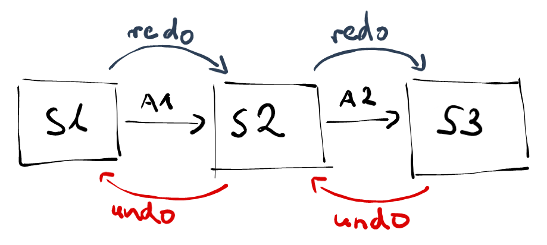

Having the ability to undo your actions has long moved from being an
[attractive product quality](https://en.wikipedia.org/wiki/Kano_model)
towards a must-be one. People just expect this type of fault tolerance
from any reasonably complex tool. Yet, as often in software development,
growing user expectations can be surprisingly far from ease of their
implementation. In this post we'll be looking at how you might go about
pulling it off in your next Angular app.



At its core, the general undo-redo feature can be described as the
ability to go back to previous application states, and once there, in
turn, go forward to then future states. Sounds easy right? It's so
inherit to most people's workflow that you take it for granted. Yet,
when its your turn to put the logic behind `Ctrl+Z` and `Ctrl+Y` you
might be in for a surprise: there isn't - and there probably can't be -
a pluggable solution if you didn't plan ahead.

Talking about application state in web applications the redux pattern
quickly comes to mind. It can be seen as an extension of the
[command pattern](https://en.wikipedia.org/wiki/Command_pattern) - a
common tool for implementing undo-redo. Redux provides a good foundation
through its
[three principles](https://redux.js.org/introduction/three-principles):

1) **Single source of truth:** By having the whole application state in
   one place - the store - we can get an easy grip on past, present and
   future states.
2) **State is read-only:** State is mutated in a deterministic way and we
  don't have to worry about states being corrupted.
3) **Changes are made with pure functions:** We can easily replace the
  whole state.

You'll quickly end up at
[redux](https://redux.js.org/) - and it's Angular counterpart
[NgRx](https://ngrx.io/) - when searching for ways to enable undo-redo
in your app. It's a good way to plan ahead, yet as we're about to see it
may not fulfill all your needs out-of-the-box.

## Switching states

For a working undo-redo feature we want to restore past and futures
states. With NgRx and redux, the straightforward solution seems to be
the memorization of what has been in the application's store. The data
structure for this approach could look like this:

```typescript
interface History {
  past: Array<State>
  present: State
  future: Array<State>
}
```

The feature would be implemented analogous to what we want to achieve.
We'd continuously save states to the past stack upon user interaction
and replace the present upon dispatch of a undo action. When this
happens we save the present state to the future stack in order to apply
it again upon dispatch of redo action. While this approach definitely
works, it has certain flaws:

**It can get big.** You're basically multiplying your application's
state. Depending on the scope you'd like to apply undo-redo to, this
will eventually use up far more memory than actually necessary. Most of
the times one transition will only change a rather small part of your
state. Recording every single bit of state is just inefficient.
   
**It's all or nothing.** You can't limit undo-redo to certain actions.
Suppose you start at state S1 and move to state S2 through an undoable
user interaction. Next you move from state S2 to S3 through some action
you don't want to be undoable. If you'd now go back to state S1 upon
undo you'd lose the changes introduced in the transition from S2 to S3.
You might overcome this
[issue](https://github.com/omnidan/redux-undo/issues/106) through
careful reducer composition which can be really hard to achieve
sometimes though.
   

![all-or-nothing]

Despite these drawbacks, the
[endorsed library](https://github.com/omnidan/redux-undo/) for
implementing undo-redo with the main redux library is [using this
approach](https://redux.js.org/recipes/implementing-undo-history).
There's nothing as big for NgRx yet some smaller ones are using the
approach as well.

## Repeating history

Reducers are just pure functions. Calculating the next state based on a
dispatched action can be repeated deterministically at any time with the
same result. If an action A1 changes our state S1 to S2 and another
action A2 again transitions S2 to S3, we'd be able to return to S2 when
recalculating it by applying A1 to S1. 

![recalculate-state]

Therefore, in order to enable undo, we could also keep track of any
dispatched action, replay them all except for the last one and we'd be
one step into the past. A corresponding data structure could look like
follows, where we'd push applied actions to a list and have a saved base
state we'd use for recalculation.

```typescript
interface History {
  actions: Array<Action>
  base: State
}

// pseudo-code for calculating last state
const undo = (state) => history.actions
    .slice(0, -1) // every action except the last one
    .reduce((state, action) => reducer(state, action), history.base)
```

Again, the approach works and there are libraries for redux and NgRx,
respectively. It
[can even be more lightweight](https://github.com/JannicBeck/undox#motivation)
as actions are generally less heavy than your whole application state.
Yet, depending on your reducer logic, it **may be expensive** to
recalculate the state recursively from the start just to know where you
were one second ago. Also, **it's still all or nothing** - limiting the
state recalculation to certain actions will loose you information.

## States are changing

States in redux may supposed to be immutable, yet reducers are
effectively changing them over time - just not by reusing the same
object. Although often easily inferred, in my opinion redux won't give
you fully-fledged undo-redo by itself because information about these
changes, the state difference introduced through a transition, is lost.
Take a look at undo-redo implementations before redux
[using the command pattern](https://www.codeproject.com/Articles/33384/Multilevel-Undo-and-Redo-Implementation-in-Cshar-2).
You'd have to implement a return path for each transition in order to
get back. Luckily, there's also an easier way than implementing
something like reverse reducers to get the best of both worlds. You can
keep track of changes introduced by a transition in a so-called
[JSON Patch](https://tools.ietf.org/html/rfc6902)

```typescript
// your state
const S1 = { "foo": "bar" }

// JSON Patch representing what your reducer did to change the state
const patch = [
    { "op": "add", "path": "/baz", "value": "qux" }
]

// your resulting next state
const S2 = { "foo": "bar", "baz": "qux" }
```

It gets even better: there are libraries constructing these patches for
you and chances are you're already using one of them. The
[immer](https://github.com/immerjs/immer) library is used widely to
ensure state immutability while being able to use originally mutating
JavaScript APIs. immer can not just create patches from your
transitions, it also provides you with the corresponding inverse
patches. Staying with the example above you'd easily be able to undo an
action using the inverse patch from the corresponding state transition:

```typescript
// your result state from before
const S2 = { "foo": "bar", "baz": "qux" }

// JSON Patch representing the reverse of what your reducer did to change the state
const inversePatch = [
     { "op": "remove", "path": "/baz" }
]

// your resulting initial state
const S1 = { "foo": "bar" }
```

Using this approach you're sparred from the memory overhead you'd have
when remembering whole application states and also from the
computational overhead you'd have when recalculating the last state. By
using just the essential information your implementation can be
**maximally lightweight**. You're also more flexible as it **doesn't
have to be all or nothing anymore**. If you want to omit an action from
the undo-redo feature you can just ignore its patches when undoing or
redoing.

I've created the library
[ngrx-wieder](https://github.com/nilsmehlhorn/ngrx-wieder) for using
this approach with NgRx. It'll also allow you to merge consecutive
changes of actions and track whether you can undo or redo at the moment.
Here's an example on StackBlitz:
<iframe 
style="width: 100%; height: 520px"
src="https://stackblitz.com/edit/ngrx-wieder-app?ctl=1&embed=1&file=src/app/app.component.ts&view=preview">
</iframe>
